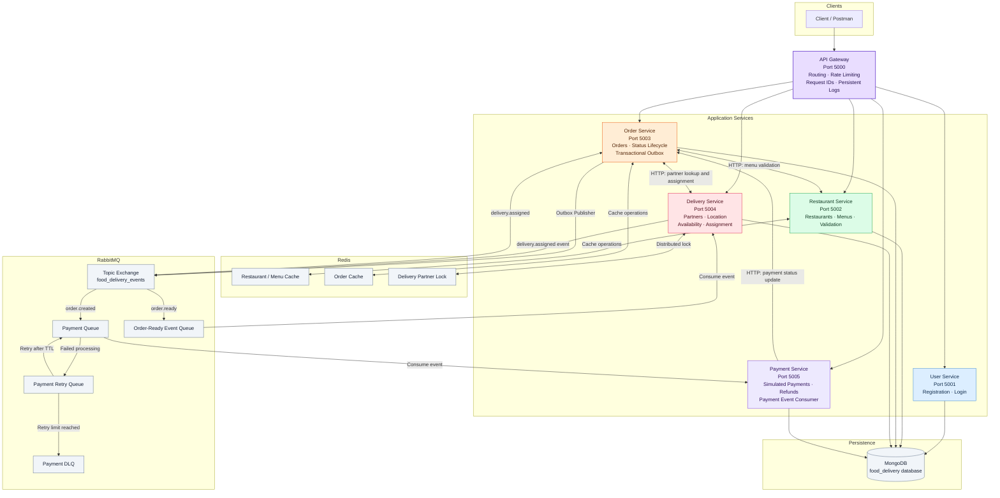
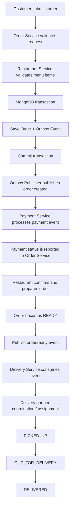
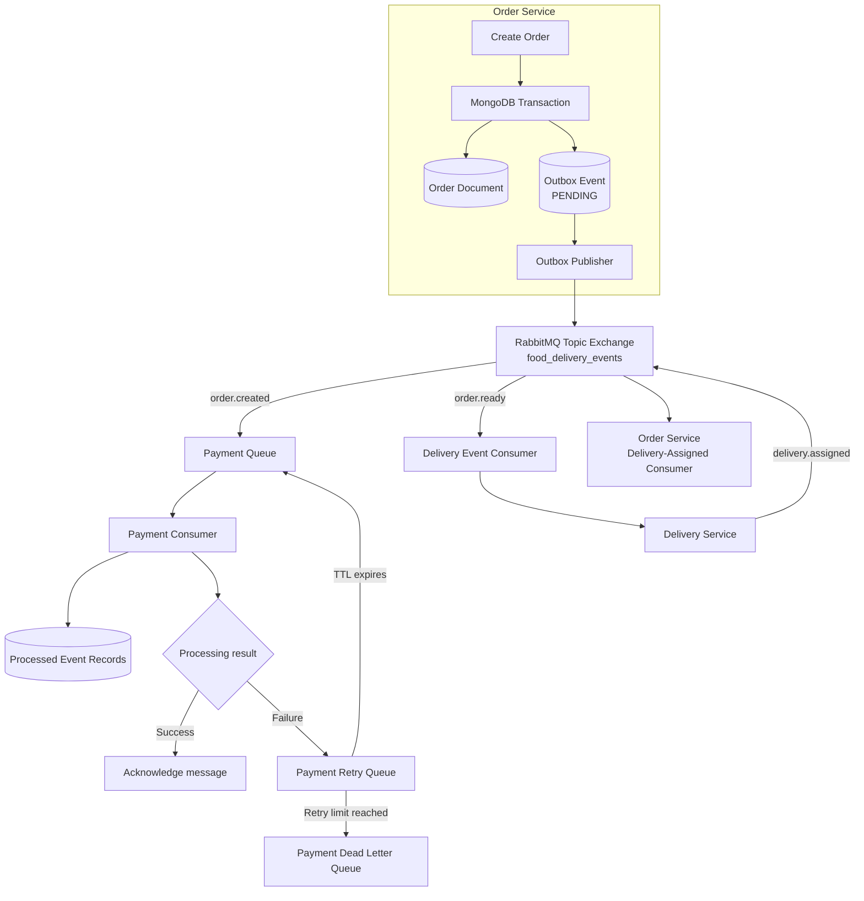
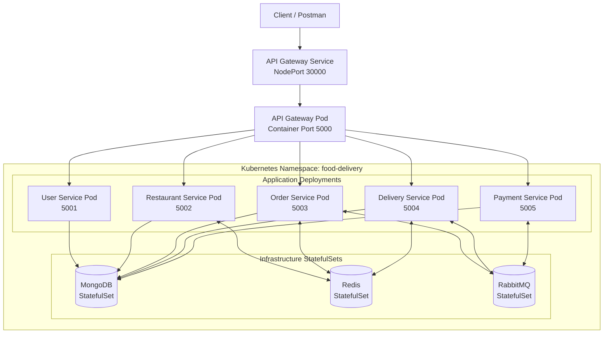

# Distributed Food Delivery Platform

A backend-focused distributed food delivery system built with **Node.js, Express, MongoDB, Redis, RabbitMQ, Docker, and Kubernetes**. The application is divided into five independently runnable microservices and an API Gateway.

The project demonstrates service decomposition, synchronous inter-service communication, asynchronous event processing, caching, distributed locking, transactional event publishing, retries, dead-letter handling, containerization, and local Kubernetes deployment.

---

## Table of Contents

- [Overview](#overview)
- [Key Features](#key-features)
- [Technology Stack](#technology-stack)
- [System Architecture](#system-architecture)
- [Order Lifecycle](#order-lifecycle)
- [Event-Driven Architecture and Reliability](#event-driven-architecture-and-reliability)
- [Services and Responsibilities](#services-and-responsibilities)
- [Communication and Infrastructure](#communication-and-infrastructure)
- [Authentication and Authorization](#authentication-and-authorization)
- [API Overview](#api-overview)
- [Running Locally with Docker Compose](#running-locally-with-docker-compose)
- [Deploying to Minikube](#deploying-to-minikube)
- [Testing and Verification](#testing-and-verification)
- [Repository Structure](#repository-structure)
- [Current Scope and Limitations](#current-scope-and-limitations)
- [Future Enhancements](#future-enhancements)

---

## Overview

The platform separates the main food-delivery capabilities into dedicated services:

- **User Service** — registration and login.
- **Restaurant Service** — restaurant and menu management.
- **Order Service** — order creation, status transitions, and coordination.
- **Delivery Service** — delivery-partner availability, location, and assignment.
- **Payment Service** — simulated payment and refund operations, plus asynchronous payment-event consumption.
- **API Gateway** — the external entry point for routing requests to the services.

MongoDB provides persistent storage. Redis is used for caching and delivery-partner distributed locking. RabbitMQ supports asynchronous communication between services.

## Key Features

- Five backend microservices with separate service entry points.
- API Gateway on port **5000**, with service routing, rate limiting, request IDs, and persistent request logging.
- JWT-based authentication and role-based authorization in protected service routes.
- MongoDB persistence, including replica-set configuration for transaction support.
- Redis caching for restaurant/menu and order data.
- Redis-based distributed locking during delivery-partner assignment.
- RabbitMQ topic exchange for asynchronous events.
- Transactional Outbox pattern for reliable event publication from the Order Service.
- Processed-event tracking to make the payment consumer idempotent against duplicate deliveries.
- Bounded payment-event retries and a Dead Letter Queue (DLQ).
- Dockerfiles and Docker Compose configuration for local containerized execution.
- Kubernetes manifests organized with Kustomize for local Minikube deployment.
- API Gateway request IDs and persistent logs for basic observability.

---

## Technology Stack

| Area | Technology |
|---|---|
| Runtime | Node.js |
| Backend framework | Express.js |
| Database | MongoDB, Mongoose |
| Cache and distributed lock | Redis |
| Message broker | RabbitMQ |
| Authentication | JSON Web Tokens (JWT), bcrypt |
| API routing | Express-based API Gateway |
| Containerization | Docker, Docker Compose |
| Orchestration | Kubernetes, Minikube, Kustomize |
| Testing tools | Jest, Supertest, Postman |
| Version control | Git, GitHub |

---

## System Architecture

The API Gateway exposes a single entry point to clients and routes requests to the five services. The services use HTTP for selected synchronous operations and RabbitMQ for asynchronous event communication. Each service connects to MongoDB for persistence; Redis is used by the Restaurant, Order, and Delivery services for their respective caching or coordination requirements.



### Architecture notes

- The API Gateway listens on port **5000**. The five application services listen on ports **5001–5005**.
- Menu endpoints are served by the Restaurant Service; there is no separate Menu microservice.
- The Order Service uses internal HTTP endpoints exposed by the Restaurant and Delivery services for synchronous coordination.
- The Payment Service updates payment status through an internal Order Service endpoint.
- The diagram shows the logical event flow and queue roles. Queue bindings and routing keys are configured in the service RabbitMQ setup.
- JWT verification and role checks happen in protected service routes, not centrally in the API Gateway.

---

## Order Lifecycle

The Order Service coordinates order creation and the main order-state transitions. It validates requested menu items with the Restaurant Service, obtains authoritative item prices, and persists the order and its outbox event in the same MongoDB transaction.



### Order status and role responsibilities

The Order Service enforces role-dependent transitions. The implemented flow includes:

- Restaurant owner: `PLACED` → `CONFIRMED` → `PREPARING` → `READY`.
- Customer: may cancel an order while it is `PLACED`; an eligible paid online order follows the refund flow.
- Delivery partner: `READY` → `PICKED_UP` → `OUT_FOR_DELIVERY` → `DELIVERED`.

An online-paid order must have a successful payment status before restaurant confirmation. Delivery completion is coordinated with the Delivery Service.

---

## Event-Driven Architecture and Reliability

RabbitMQ uses the topic exchange `food_delivery_events`. The Order Service's Transactional Outbox pattern stores the order and its event record in the same MongoDB transaction. A separate publisher reads pending outbox records and publishes them to RabbitMQ.



### Reliability mechanisms implemented

- **Transactional Outbox:** order persistence and creation of the corresponding outbox event happen in one MongoDB transaction.
- **Publisher confirmation:** the publisher uses RabbitMQ publisher confirms when publishing pending events.
- **Idempotent event consumption:** the Payment Service stores processed event identifiers and ignores duplicates.
- **Bounded retries:** failed payment-event processing is retried through a retry queue with a configured message TTL and retry limit.
- **Dead Letter Queue:** messages that exceed the retry limit are routed to the payment DLQ for inspection and recovery.
- **Redis distributed locking:** Delivery Service uses an expiring Redis lock when assigning a delivery partner, helping prevent concurrent assignment of the same partner.

The retry/DLQ flow described above applies to payment-event processing. It should not be interpreted as a claim that every service has an identical retry policy.

---

## Services and Responsibilities

| Service | Port | Main responsibilities |
|---|---:|---|
| API Gateway | 5000 | Routes external requests, rate limiting, request IDs, persistent request logging, and selected internal-path blocking |
| User Service | 5001 | User registration, login, password hashing, JWT issuance |
| Restaurant Service | 5002 | Restaurant CRUD, menu CRUD, menu validation, restaurant/menu caching |
| Order Service | 5003 | Order creation, order lifecycle, cancellation coordination, outbox publishing, order caching, delivery coordination |
| Delivery Service | 5004 | Delivery-partner profiles, online/availability state, location updates, nearest-partner selection, assignment and completion |
| Payment Service | 5005 | Simulated payment operations, refunds, payment-event consumer, processed-event tracking, retry and DLQ handling |

## Communication and Infrastructure

### Synchronous HTTP communication

The services use configured internal service URLs for operations that require an immediate response. Examples include:

- Order Service → Restaurant Service: validate menu items and retrieve restaurant information.
- Order Service → Delivery Service: find or assign a delivery partner and coordinate delivery operations.
- Payment Service → Order Service: update an order's payment status after payment processing or refund handling.

### MongoDB

The services use the `food_delivery` database. The application stores users, restaurants, menu items, orders, delivery partners, payments, outbox events, and processed-event records in their respective collections.

The Order Service uses MongoDB transactions for atomic order and outbox-event persistence. Its MongoDB connection must use a replica-set-enabled deployment.

### Redis

Redis is used for:

- Restaurant and menu caching in the Restaurant Service.
- Order and order-list caching in the Order Service.
- Distributed locking during delivery-partner assignment in the Delivery Service.

The application uses cache invalidation when relevant restaurant, menu, or order data changes.

### RabbitMQ

RabbitMQ provides asynchronous event communication through the `food_delivery_events` topic exchange. The implemented flows include order-created/payment processing, order-ready delivery processing, and delivery-assigned notification to the Order Service.

---

## Authentication and Authorization

JWT-based authentication and role-based authorization are implemented in protected service routes.

- Login issues a signed JWT.
- The token is stored in an HTTP-only cookie named `token`.
- Protected routes verify the token using the service's `JWT_SECRET`.
- Role middleware checks permissions for routes that require specific roles.

Roles used by the application:

- `customer`
- `restaurant_owner`
- `delivery_partner`
- `admin`

**Security scope:** authentication is not centralized in the API Gateway. Some internal service endpoints and Payment Service routes do not have independent authentication middleware in the current implementation. Separate service-to-service authentication is a known hardening task. Do not expose `.env` files, JWT secrets, database credentials, or RabbitMQ credentials in the repository.

---

## API Overview

All external requests are intended to enter through the API Gateway at `http://localhost:5000`. The gateway routes requests to the relevant service.

| Area | Method | Route | Purpose |
|---|---|---|---|
| Users | POST | `/api/users/register` | Register a user |
| Users | POST | `/api/users/login` | Log in |
| Restaurants | POST | `/api/restaurants` | Create a restaurant |
| Restaurants | GET | `/api/restaurants` | List restaurants |
| Restaurants | GET | `/api/restaurants/:id` | Get restaurant details |
| Menu | POST | `/api/menu` | Create a menu item |
| Menu | GET | `/api/menu/restaurant/:restaurantId` | List a restaurant's menu |
| Menu | GET | `/api/menu/:id` | Get menu item details |
| Orders | POST | `/api/orders` | Create an order |
| Orders | GET | `/api/orders/my` | List the customer's orders |
| Orders | GET | `/api/orders/:id` | Get order details |
| Orders | PATCH | `/api/orders/:id/status` | Update an order status |
| Delivery | POST | `/api/delivery` | Create a delivery-partner profile |
| Delivery | GET | `/api/delivery/profile` | Get delivery-partner profile |
| Payments | POST | `/api/payments` | Create/process a simulated payment |
| Payments | GET | `/api/payments/order/:orderId` | Get payment for an order |
| Payments | PATCH | `/api/payments/refund` | Refund an eligible payment |

The route list is a high-level external API overview, not an exhaustive list of internal service endpoints. Access to individual routes depends on the authentication and role middleware configured for that route.

### Health check

The API Gateway exposes:

```http
GET /health
```

---

## Running Locally with Docker Compose

### Prerequisites

- Git
- Docker Desktop with Docker Compose
- Node.js only if you also want to run services directly outside containers

### 1. Clone the repository

```bash
git clone <YOUR_GITHUB_REPOSITORY_URL>
cd <YOUR_REPOSITORY_DIRECTORY>
```

Replace the placeholders with your repository URL and directory name.

### 2. Configure environment files

The Compose configuration references environment files for the individual services and a root `.env.docker` file for Compose variable substitution.

Create/configure the required local files using the variable names expected by the corresponding service configuration and `docker-compose.yml`.

At minimum, the application configuration uses variables from these groups:

- `PORT`
- `MONGO_URI`
- `JWT_SECRET`
- `NODE_ENV`
- `REDIS_URL`
- `RABBITMQ_URL`
- `USER_SERVICE_URL`
- `RESTAURANT_SERVICE_URL`
- `ORDER_SERVICE_URL`
- `DELIVERY_SERVICE_URL`
- `PAYMENT_SERVICE_URL`

The Compose configuration also interpolates `RABBITMQ_USER` and `RABBITMQ_PASSWORD`.

Use your own local values. **Do not commit `.env`, `.env.docker`, or any file containing credentials.** The repository's `.gitignore` excludes environment files.

### 3. Build the service images

The Compose file references local images, so build the images before starting the stack:

```bash
docker build -t food-delivery-user-service:latest ./services/user-service
docker build -t food-delivery-restaurant-service:latest ./services/restaurant-service
docker build -t food-delivery-order-service:latest ./services/order-service
docker build -t food-delivery-delivery-service:latest ./services/delivery-service
docker build -t food-delivery-payment-service:latest ./services/payment-service
docker build -t food-delivery-api-gateway:latest ./services/api-gateway
```

### 4. Start the application

```bash
docker compose --env-file .env.docker up -d
```

Check the containers:

```bash
docker compose ps
```

Follow logs:

```bash
docker compose logs -f
```

Open the API Gateway:

```text
http://localhost:5000
```

The Compose configuration also exposes the MongoDB host port as `27018` and the RabbitMQ management UI as `http://localhost:15672`. The RabbitMQ AMQP port is used for container-to-container communication on the Compose network.

Stop the stack:

```bash
docker compose down
```

To remove the Compose-managed data volumes as well (this deletes persisted local data):

```bash
docker compose down -v
```

---

## Deploying to Minikube

The repository includes Kubernetes manifests under `k8s/`, organized with Kustomize.

The following diagram shows the local deployment topology. The API Gateway is exposed through a NodePort; the application services and infrastructure components communicate inside the Kubernetes namespace.



### Prerequisites

- Docker Desktop
- Minikube
- `kubectl`

### 1. Start Minikube

```bash
minikube start
```

### 2. Build or load the application images

The Kubernetes Deployments refer to these local image tags:

```text
food-delivery-user-service:latest
food-delivery-restaurant-service:latest
food-delivery-order-service:latest
food-delivery-delivery-service:latest
food-delivery-payment-service:latest
food-delivery-api-gateway:latest
```

Build the images as described in the Docker Compose section. Make sure the images are available to the Minikube node before applying the manifests. One option is:

```bash
minikube image load food-delivery-user-service:latest
minikube image load food-delivery-restaurant-service:latest
minikube image load food-delivery-order-service:latest
minikube image load food-delivery-delivery-service:latest
minikube image load food-delivery-payment-service:latest
minikube image load food-delivery-api-gateway:latest
```

### 3. Create the required Kubernetes Secrets

The Deployments reference pre-existing Kubernetes Secrets. The RabbitMQ StatefulSet also references `rabbitmq-secret`.

Create the Secrets in the `food-delivery` namespace using your own environment-specific credentials before applying the application manifests. The referenced Secret names are:

- `rabbitmq-secret`
- `api-gateway-secret`
- `user-service-secret`
- `restaurant-service-secret`
- `order-service-secret`
- `delivery-service-secret`
- `payment-service-secret`

The manifests reference these Secrets; they do not contain real credential values. Keep Secret values out of Git. Ensure that the Secret keys match the `secretKeyRef` entries in the corresponding manifests.

### 4. Apply the Kubernetes manifests

```bash
kubectl apply -k k8s/
```

Check the resources:

```bash
kubectl get pods -n food-delivery
kubectl get services -n food-delivery
kubectl get deployments -n food-delivery
```

Inspect a pod if it is not starting:

```bash
kubectl describe pod <POD_NAME> -n food-delivery
kubectl logs <POD_NAME> -n food-delivery
```

### 5. Access the API Gateway

The API Gateway Service is configured as a NodePort on `30000`:

```bash
minikube service api-gateway -n food-delivery --url
```

Use the URL printed by Minikube as the API base URL.

> **Kubernetes note:** MongoDB is configured to run with replica-set mode. Ensure the replica set is initialized in the Minikube environment before relying on Order Service transactions. Starting `mongod` with `--replSet rs0` alone does not initialize the replica-set configuration.

---

## Testing and Verification

The project has been verified through a combination of manual API testing and focused automated tests during development.

- Use Postman to test registration, login, restaurant/menu operations, order creation, status transitions, delivery coordination, payment, and refunds.
- The root project includes a Jest test command.
- The Order Service includes its own Jest test setup.
- RabbitMQ behavior was checked for event consumption, duplicate-event handling, retry behavior, and DLQ routing.
- Docker Compose and Minikube deployments were used to verify containerized and Kubernetes execution.

Run the root test command:

```bash
npm test
```

Run the Order Service tests:

```bash
cd services/order-service
npm test
```

Automated test coverage is not uniform across all services. Do not interpret the commands above as a claim that every microservice has a complete automated integration-test suite.

---

## Repository Structure

```text
.
├── config/
├── controllers/                 # Legacy/root application code
├── models/                      # Legacy/root application models
├── routes/                      # Legacy/root application routes
├── services/
│   ├── api-gateway/
│   ├── user-service/
│   ├── restaurant-service/
│   ├── order-service/
│   ├── delivery-service/
│   └── payment-service/
├── k8s/
│   ├── infrastructure/
│   │   ├── mongodb/
│   │   ├── redis/
│   │   └── rabbitmq/
│   └── services/
├── tests/
├── utils/
├── docker-compose.yml
├── jest.config.js
├── package.json
└── README.md
```

The active distributed application is implemented under `services/` and exposed through the API Gateway. Root-level application files are retained as part of the repository's earlier implementation.

---

## Current Scope and Limitations

- This is a backend project; a production frontend is not included.
- Payment processing is simulated. No live Razorpay, Stripe, or other payment-provider integration is included.
- The Kubernetes deployment targets a local Minikube environment; cloud deployment is not included in this version.
- JWT authentication and role-based checks exist in protected service routes, but authentication is not centralized at the Gateway.
- Some internal endpoints do not have independent service-to-service authentication. This is a known security-hardening item.
- Automated test coverage is not yet comprehensive or uniform across all services.
- Kubernetes Secret objects must be created in the target namespace before deploying manifests that reference them.

## Future Enhancements

- Add authenticated service-to-service communication for internal HTTP endpoints.
- Integrate a real payment provider with verified webhook handling.
- Expand automated integration and end-to-end test coverage.
- Add centralized metrics, tracing, and dashboards.
- Improve Kubernetes secret management and deployment automation.
- Plan and implement a cloud deployment.

---

## Author

**Piyush Mishra**  
B.Tech, IIIT Bhopal

---

